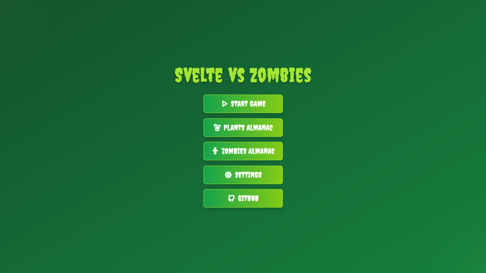
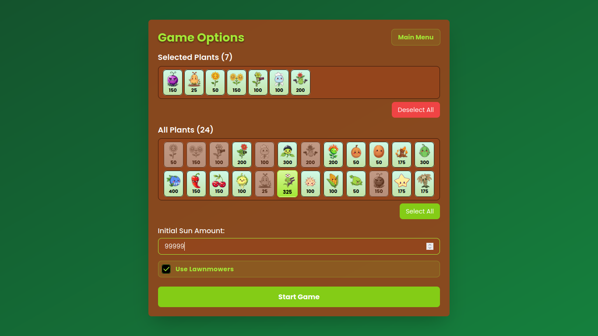
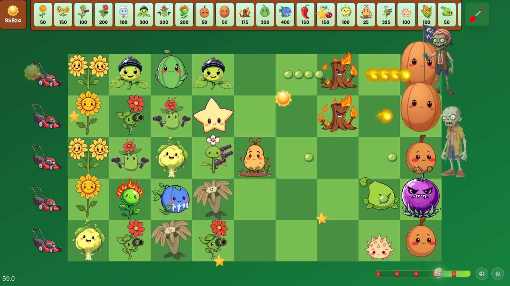
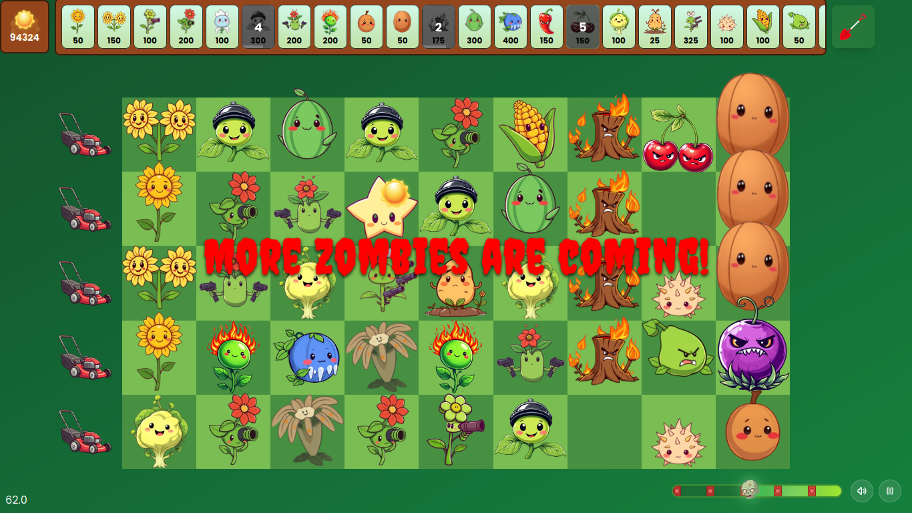
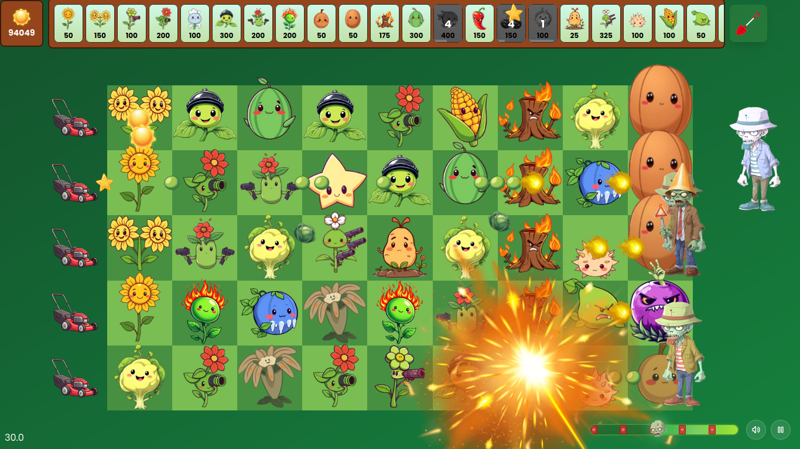
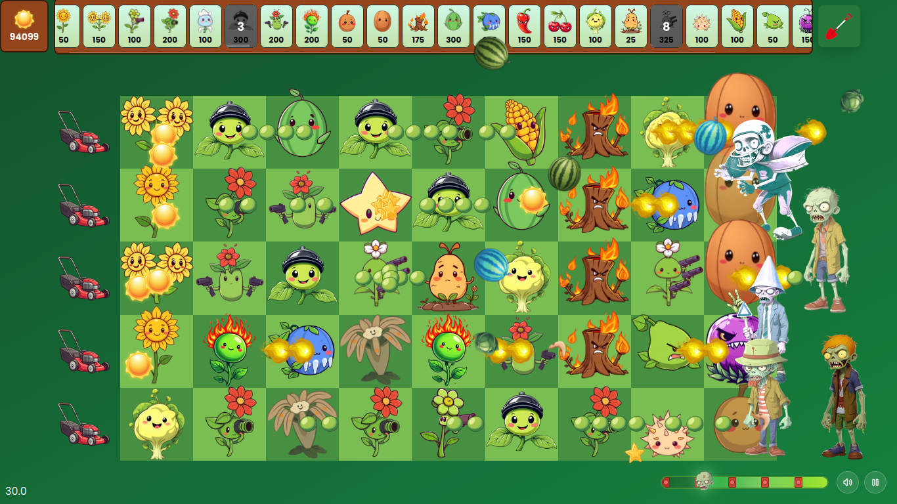
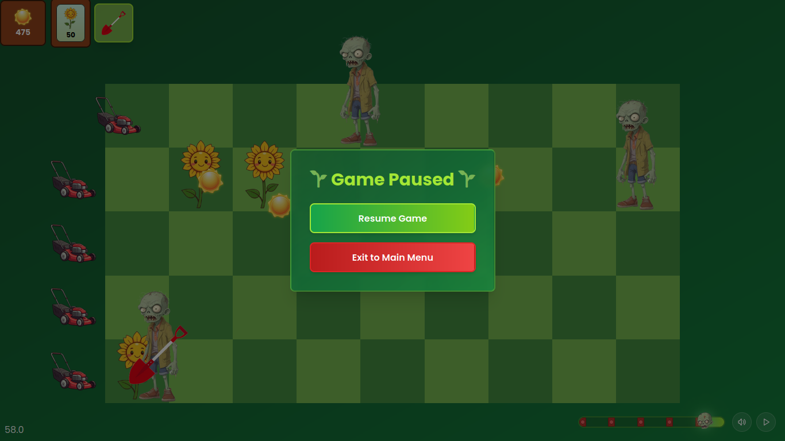
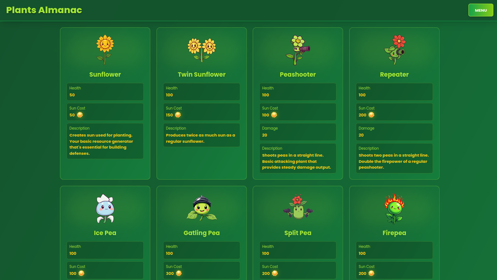
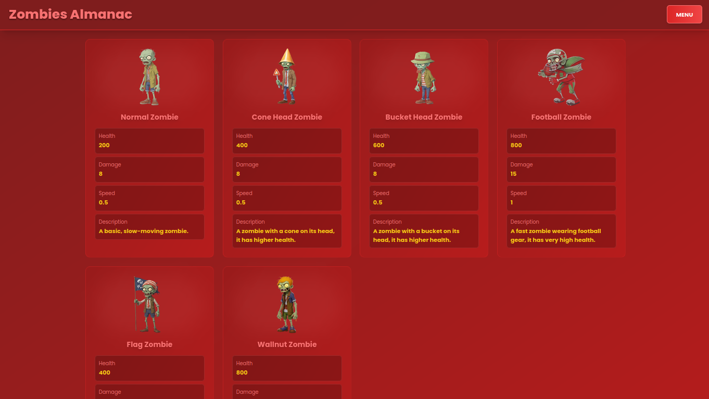

# Svelte and Zombies

[](https://svelte.dev)
[](https://www.gnu.org/licenses/gpl-3.0)
[](https://github.com/oggnimodd/svelte-and-zombies)

A fan-made recreation of the beloved [Plants vs. Zombies](https://www.ea.com/ea-studios/popcap/plants-vs-zombies) game, rebuilt in Svelte 5 using only DOM, no canvas or WebGL.

## Demonstration

You can play the game here:

- [https://svelte-and-zombies.vercel.app](https://svelte-and-zombies.vercel.app) (**Vercel** - Primary Link)
- [https://svelte-and-zombies.netlify.app](https://svelte-and-zombies.netlify.app) (**Netlify** - Alternative Link)

Demo video:

<video src="https://asset.cloudinary.com/dojzwv5b1/97605008f575d1738e183baa5bdbeedd" controls width="720"></video>

## About This Project

This project was developed as a submission for the [Svelte Hack 2024](https://hack.sveltesociety.dev/2024), showcasing the capabilities of Svelte 5 in building complex and engaging game-like applications without relying on traditional canvas or WebGL rendering. Instead, every UI element, plant, zombie, and projectile is rendered using standard HTML and CSS, leveraging the power of Svelte's 5.

## Key Features Implemented

- **Faithful Recreation:** Captures the core gameplay loop of Plants vs. Zombies, including planting, zombie waves, sun collection, and strategic lawn defense.
- **HTML-Based Rendering:** Every game object is rendered using pure HTML elements, styled with CSS, and animated using Svelte's transitions and reactivity. No canvas or WebGL involved.
- **Reactive Game State:** Utilizes Svelte's reactivity system for managing game state, plant cooldowns, zombie movement, and projectile interactions.
- **Plant Variety:** Includes a selection of iconic plants, each with unique abilities and stats (Peashooter, Repeater, Sunflower, Wallnut, etc.).
- **Diverse Zombies:** Features a range of zombies with different health, speed, and damage characteristics (Normal Zombie, Conehead Zombie, Buckethead Zombie, etc.).
- **Strategic Gameplay:** Players strategically place plants in lanes to defend against waves of advancing zombies, managing sun resources and plant cooldowns.
- **Sound Effects:** Integrated sound effects for various game actions, enhancing the user experience (using Howler.js).
- **User Interface:** Implemented a responsive UI that adapts to different screen sizes, including mobile devices. Supports fullscreen mode on mobile.
- **Game States:** Includes a main menu, loading screen, and pause, win, and lose modals.
- **Almanac:** A basic almanac to view the plants and zombies.
- **Lawnmowers:** Functional lawnmowers to stop zombies that breach your defenses.
- **Explosions & Effects:** Visual effects such as explosions, charred zombies, and plant hit animations.
- **Plant Damage and Interactions:** Plants can be damaged, have health, and have effects when hit by projectiles.
- **Projectile system:** Projectiles are implemented with animations using CSS transformations. Includes pea, fire pea, cabbage, melon, kernel, star, and boomerang projectiles.
- **Game Customization:** Players can select their preferred plants, set initial sun amount, and toggle lawnmowers before starting each game.

## Screenshots

|                  Main Menu                  |                Game Options                 |
| :-----------------------------------------: | :-----------------------------------------: |
|               |         |
|             **Loading Screen**              |                **Gameplay**                 |
|     |  |
|                **Gameplay**                 |                **Gameplay**                 |
|  |  |
|                **Gameplay**                 |                **Gameplay**                 |
|  |  |
|             **Plants Almanac**              |             **Zombies Almanac**             |
|     |   |
|             **Gameplay Mobile**             |                                             |
|    |                                             |

## Tech Stack

- **SvelteKit with Svelte 5:** The primary framework for building the UI and managing the game's state.
- **TypeScript:** Used for type safety and better code organization.
- **Tailwind CSS:** For utility-first styling and rapid UI development.
- **Howler.js** For sound management
- **Vite:** Used as the build tool and development server.

## Getting Started

To run the project locally:

1.  Clone the repository:
    ```bash
    git clone https://github.com/oggnimodd/svelte-and-zombies.git
    ```
2.  Navigate to the project directory:
    ```bash
    cd svelte-and-zombies
    ```
3.  Install dependencies:
    ```bash
    bun install
    ```
4.  Generate the preload list:
    ```bash
    bun scripts/generatePreloadList.ts
    ```
5.  Start the development server:
    ```bash
    bun run dev
    ```
6.  Open your browser and go to `http://localhost:5173`.

## Attribution and License

### Code License

The **code part** for this project is licensed under the [GNU General Public License v3.0 (GPL-3.0)](https://www.gnu.org/licenses/gpl-3.0.en.html).

### Game assets

The visual assets for this project were generated using generative AI tools.

### Music Attribution

Background music provided by [Uppbeat](https://uppbeat.io):

"Quest of Legends" by [Vocalista](https://uppbeat.io/browse/artist/vocalista)

Source: https://uppbeat.io/t/vocalista/quest-of-legends
License code: PFIMAM8XJTTCRSQR

## Disclaimer

This project is a fan-made recreation of the original Plants vs. Zombies game. It is not affiliated with, endorsed by, or in any way officially connected with PopCap Games or Electronic Arts, the creators and owners of the Plants vs. Zombies franchise. This project is intended as a demonstration of Svelte 5 capabilities.
